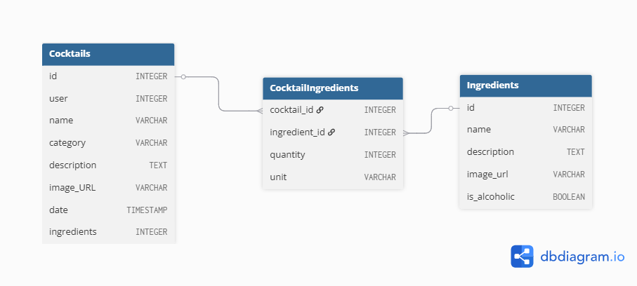

# CocktailMIX

Na wstępie chciałabym zaznaczyć, że wiem, że nie jest to REST API. Przeoczyłam to w wymaganiach - napisałam do Was w tej sprawie maila :) 

https://ixgvah.pythonanywhere.com/

## Setup

1. Sklonuj repo: 
```bash
git clone https://github.com/ixgvah/solvro-recruitment-task.git
cd solvro-recruitment-task
```

2. Stwórz wirtualne środowisko i pobierz zależności
```bash
pip install -r requirements.txt
```

3. Wykonaj migracje:
```bash
python manage.py migrate
```

4. Odpal serwer:
```bash
python manage.py runserver
```

5. Przejdź do: `http://127.0.0.1:8000/`

## Co zostało zrobione: 
- pełny CRUD zarówno dla koktajli jak i dla składników
- rejestracja i logowanie
- uprawnienia: zalogowany użytkownik może dodawać koktajle oraz eytować/usuwać te stworzone przez niego
- uprawnienia: każdy zalogowany użytkownik może dodawać oraz usuwać i edytować każdy składnik
- każdy użytkownik posiada zakładkę z ulubionymi koktajlami
- paginacja


## Database schema
